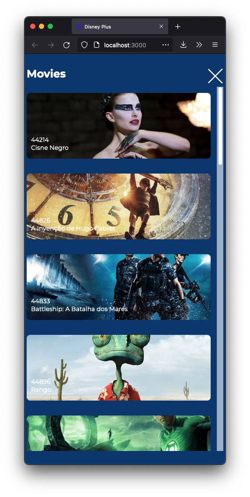

<h1 align="center">
  UI Clone - Disney Plus
</h1>

## 💻 Project

This project is a clone of Disney Plus Catalog

<a href="https://disney-plus-ui.vercel.app/" target="_blank">Open Site</a>

Design by [**Itai Bracha**](https://www.figma.com/@itaibracha), [click here](https://www.figma.com/file/AfcZjKNRxDWOSSI0vrnrls?node-id=0%3A105) open project figma.

## 🚀 Technology

- HTML
- SCSS
- JavaScript
- React JS
- Vite
- [API TMDB](https://www.themoviedb.org/documentation/api)

## 📔 Detail

- [x]  Semantic HTML
- [x]  Integration with API TMDB `AXIOS`
- [x]  Interactive menu
- [x]  Add favicon
- [x]  Responsibilty with com `@media`
- [x]  scss
- [x]  react + vite
- [x]  hooks

## 📺 Desktop

<table>
  <tr>
    <td valign="top"></td>
  </tr>
  <tr>
    <td valign="top"></td>
  </tr>
</table>

---

## 📺 Mobile

<table>
  <tr>
    <td valign="top"></td>
    <td valign="top"></td>
  </tr>
</table>

